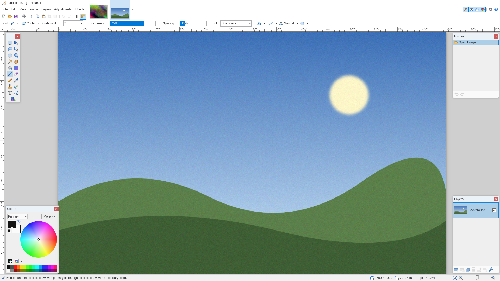
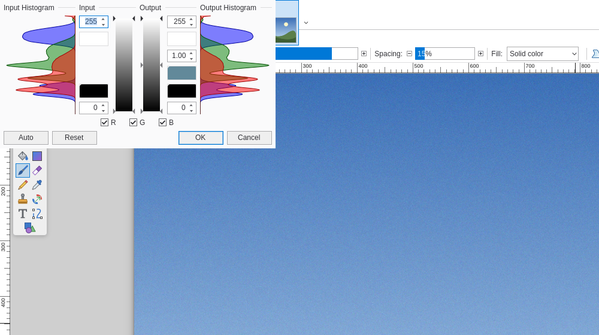
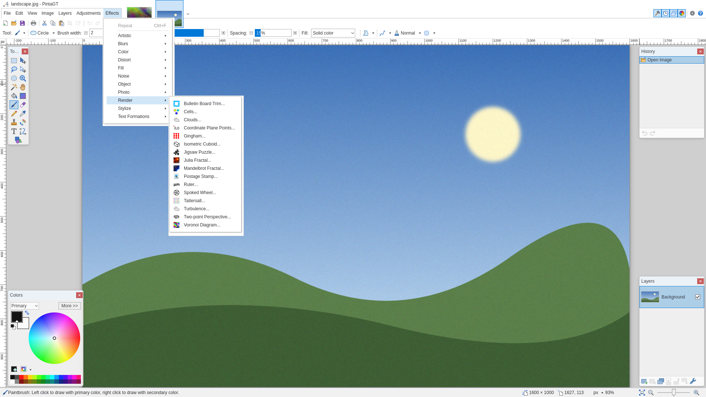
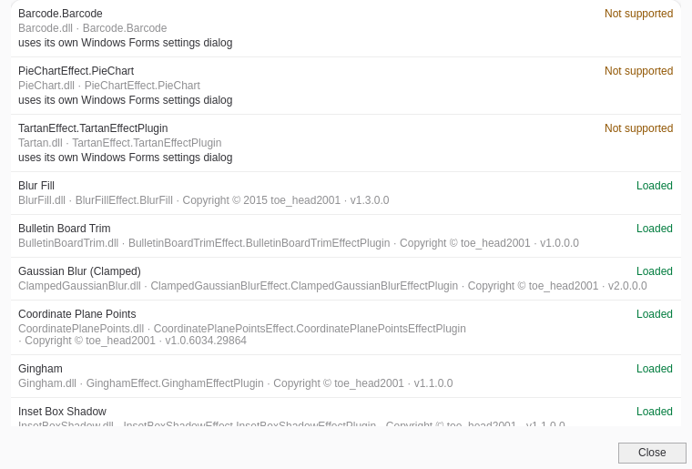

# PintaGT

PintaGT is a fork of [Pinta](https://github.com/PintaProject/Pinta) reworked to look and behave like Paint.NET 5, for people who learned image editing in Paint.NET and want the same muscle memory on Linux. It runs natively on Linux (GTK4, Wayland) and was built and tested on Hyprland.



PintaGT is an independent project. It is not affiliated with, endorsed by, or connected to Paint.NET or its developer. "Paint.NET" is used here only to describe the style of interface the fork imitates.

PintaGT is also not affiliated with or endorsed by the Pinta project or its developers. It is an unofficial fork; please don't report PintaGT problems to Pinta.

PintaGT is a personal project, maintained when I have time. It is not a supported product. Issues and pull requests are welcome, but there is no promise they will be answered.

Much of PintaGT's code was written with the help of AI coding tools, then reviewed, built and tested before it was committed.

## What's different from Pinta

**Window layout**
- Paint.NET 5's top rows:
  - a title row
  - menus with the open-image thumbnails beside them and the Tools/History/Layers/Colors toggles at the right
  - the icon toolbar
  - the tool options
- Tools, History, Layers and Colors are floating windows over the canvas, the way Paint.NET shows them. You can drag them, they snap to the edges and to each other, History and Layers can be resized, and F5–F8 toggle them. Their positions are remembered.
- Paint.NET-style status bar with the zoom slider, slim rulers, and a grey canvas surround with a drop shadow.
- Colour icons throughout (Pinta 1.x artwork and FamFamFam Silk), and a light theme by default.

**Menus and keyboard**
- Paint.NET's menu structure and names, icons in menus, and shortcut text written the Paint.NET way ("Ctrl+Shift+X").
- Paint.NET's shortcuts, for example:
  - Ctrl+Y redoes and Ctrl+Shift+Z opens Rotate/Zoom.
  - Ctrl+F repeats the last effect.
  - Ctrl+, toggles the current layer, and Alt+PgUp/PgDn move between layers.
  - Tool letters cycle through the tools that share them, and Shift+letter goes backwards.
  - `[` and `]` change the brush size.
  - Space+drag pans.

**Tools**
- Selections:
  - Paint.NET's modifiers: Ctrl adds, Alt subtracts, Ctrl+right-drag inverts, Alt+right-drag intersects.
  - Fixed Ratio and Fixed Size, and the mode icons in the toolbar.
- Move Selected Pixels and Move Selection have resize and rotate handles, and Ctrl+drag leaves a copy.
- Brushes have Hardness, Spacing and Smoothing.
- Paint.NET's single Shapes tool, with box editing.
- Paint Bucket and Magic Wand fills can still be adjusted after you click, until you press Finish.
- Gradients with Spiral types and Repeat modes.
- Paint.NET's text toolbar.
- Paint.NET's 14 blend modes.

**Dialogs and effects**
- Windows-style dialogs: stacked spin buttons, OK before Cancel, and Enter pressing OK.
- Paint.NET-style prompts for unsaved changes, pasting a large image, and flattening.
- Levels and Curves laid out like Paint.NET's.
- PNG bit depth and JPEG quality with a preview on save; Resize and Canvas Size with print size and resolution.
- Added adjustments and effects: Exposure, Highlights/Shadows, Invert Alpha, Temperature/Tint, Bokeh/Sketch/Square/Surface Blur, Crystalize, Morphology, Drop Shadow, Straighten and Turbulence.



## Paint.NET plugins

PintaGT can load many Paint.NET effect plugins (DLLs) and show them in its Effects and Adjustments menus, with their settings dialogs and live preview.

- **What works:** classic CPU effects. That includes `PropertyBasedEffect` plugins from the Paint.NET 3, 4 and 5 eras, CodeLab-made plugins, and Paint.NET 5 `BitmapEffect`s.
- **What doesn't:**
  - GPU (Direct2D) effects
  - plugins with their own Windows Forms settings dialog
  - plugins that call Windows-only native libraries

  Help > Paint.NET Plugins... lists every plugin it found, with the reason for any that can't run.
- **Track record:** in testing, 78 of 150 sampled plugin effects ran.
- **Installing:** put plugin DLLs in `~/.config/PintaGT/PdnPlugins/Effects/`. A subfolder per plugin is fine if it ships extra DLLs.
- **Reporting problems:** if a plugin misbehaves in PintaGT, report it in this repository's issues, not to the plugin's author. Plugin authors write for Paint.NET and have no reason to support PintaGT.

The compatibility layer (`Pinta.PdnShim`, `Pinta.PdnPlugins`) was written from Paint.NET's public plugin API documentation and from the metadata of third-party plugins. No Paint.NET binaries are included or were decompiled. No plugins are bundled.





## Building and running

Requires the .NET 10 SDK, GTK 4 and libadwaita.

```sh
dotnet build Pinta/Pinta.csproj -c Release
./build/bin/Pinta
```

Settings live in `~/.config/PintaGT`, separate from a regular Pinta install, so both can be installed side by side.

## Known limits

- Open and Save use the system file chooser, not Windows-style dialogs.
- The Settings dialog is still Pinta's.
- Wayland apps can't place their own windows, so the floating panels live inside the main window rather than being separate windows.

## Licence and credits

- Based on [Pinta](https://github.com/PintaProject/Pinta) by the Pinta contributors, MIT licence (`license-mit.txt`). Pinta's original README is in [docs/PINTA-README.md](docs/PINTA-README.md).
- Pinta contains code from Paint.NET 3.36, used under the MIT licence (`license-pdn.txt`). Paint.NET's logo and icon artwork are not used.
- Toolbar icons from [FamFamFam Silk](http://www.famfamfam.com/lab/icons/silk/) by Mark James, CC BY 2.5. See `Pinta.Resources/icons/silk-license.txt` and `pinta-icons.md`.
- PintaGT's changes are released under the same MIT licence.
